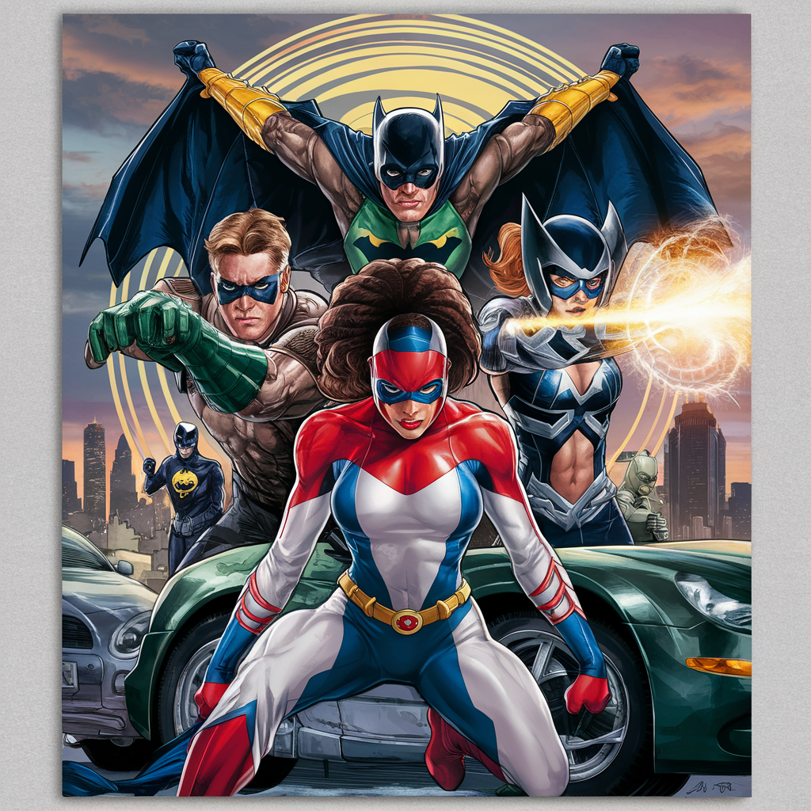

<h1 align="left">Gestión de Super-Héroes</h1>

###

Aplicación SPA que permita gestionar un mantenimiento de súper héroes. Está hecha con HTML5, CSS3, Angular Material, Angular 15.2.0 (Versión LTS)

###

    

###

<h2 align="left">Hecha con</h2>

###

    
    
    
    
    
    
    
    

###

###

<h2 align="left">URL de la web: https://alexsantanaweb.github.io/gestion-super-heroes/#/heroes </h2>

###
